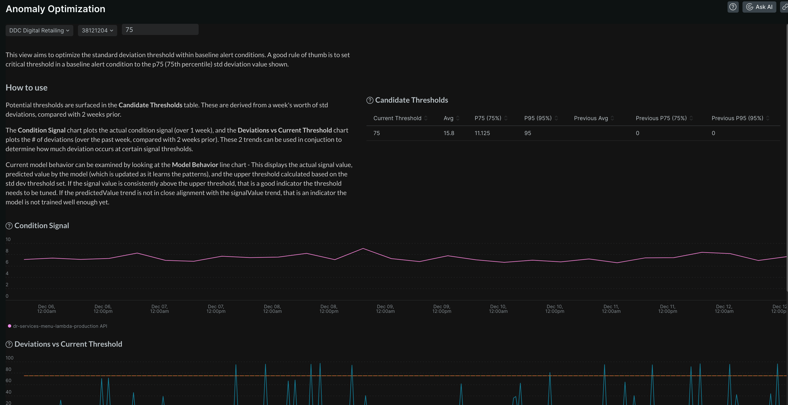

# Anomaly Optimization

## Usage
This application allows to analyze, tune, and improve baseline alert conditions configured across various accounts.

## Screenshots


## Deploying this Nerdpack

Open a command prompt in the nerdpack's directory and run the following commands.

```bash
# To create a new uuid for the nerdpack so that you can deploy it to your account:
# nr1 nerdpack:uuid -g [--profile=your_profile_name]

# To see a list of API keys / profiles available in your development environment:
# nr1 profiles:list

nr1 nerdpack:publish [--profile=your_profile_name]
nr1 nerdpack:subscribe [-c [DEV|BETA|STABLE]] [--profile=your_profile_name]
```

Visit [https://one.newrelic.com](https://one.newrelic.com), navigate to the Nerdpack, and :sparkles:
